  <h1>Pedro Reoli | Desenvolvedor Fullstack Jr</h1>
  
  

    
    
    
  

  

    
    
    
    
  

  
  

## 📊 Últimas Atualizações

  <table>
    <tr>
      <td align="center">
        <b>Status</b> 
        🟢 Online
      </td>
      <td align="center">
        <b>Projeto Ativo</b> 
        PedroReoli
      </td>
      <td align="center">
        <b>Última Atividade</b> 
        2h
      </td>
      <td align="center">
        <b>Commits Hoje</b> 
        7
      </td>
    </tr>
  </table>
  <i>Atualizado em: 30/05/2025, 20:44:38</i>

## 📊 Últimas Atualizações

  <table>
    <tr>
      <td align="center">
        <b>Status</b> 
        🟢 Online
      </td>
      <td align="center">
        <b>Projeto Ativo</b> 
        PedroReoli
      </td>
      <td align="center">
        <b>Última Atividade</b> 
        Agora
      </td>
      <td align="center">
        <b>Commits Hoje</b> 
        6
      </td>
    </tr>
  </table>
  <i>Atualizado em: 30/05/2025, 17:37:21</i>

## Sobre Mim

Opa! Sou **desenvolvedor Full Stack** com foco em **Frontend**, sempre buscando transformar ideias malucas em experiências digitais que realmente funcionam. Trabalho na **Autocom3** criando sistemas ERP que não fazem as pessoas chorarem de desespero.

- Atualmente na **Autocom3**, fazendo sistemas ERP que as pessoas realmente conseguem usar
- Desenvolvendo o [FalaAtipica](https://github.com/PedroReoli/falatipica-tutor) - meu TCC sobre acessibilidade comunicativa
- Sempre aprendendo algo novo em **React, Next.js, Three.js, Node.js e C#**
- Meu portfólio: [pedroreoliportfolio.vercel.app](https://pedroreoliportfolio.vercel.app)
- Blog onde escrevo sobre código: [Dev em Desenvolvimento](https://www.devemdesenvolvimento.com.br/)
- **Plot twist:** Quando não estou debugando, estou tocando guitarra - viciado em Blues, Metal e Rock

## 🚀 Tech Stack

### 🎨 Frontend & UI

|      |
| <b>React</b> | <b>Next.js</b> | <b>Angular</b> | <b>Vue.js</b> | <b>TypeScript</b> |

|      |
| <b>JavaScript</b> | <b>Tailwind CSS</b> | <b>Sass</b> | <b>Three.js</b> | <b>Framer Motion</b> |

### ⚙️ Backend & Languages

|      |
| <b>Node.js</b> | <b>Python</b> | <b>C#</b> | <b>Express.js</b> | <b>Blazor</b> |

|   |
| <b>PyTorch</b> | <b>Socket.IO</b> |

### 🗄️ Database & Storage

|      |
| <b>PostgreSQL</b> | <b>MySQL</b> | <b>MongoDB</b> | <b>Supabase</b> | <b>Prisma</b> |

### 🛠️ Tools & DevOps

|      |
| <b>Git</b> | <b>Docker</b> | <b>VS Code</b> | <b>Vercel</b> | <b>Figma</b> |

|  |
| <b>Vite</b> |

## 🧠 Evolução das Skills

  <h4>Análise dos últimos 30 dias de commits</h4>
  
  | Linguagem | Commits | Tendência |
  |:----------|:-------:|:----------|
  | **React/TypeScript** | 7 | ⬆️ +6 |
  | **JSON** | 6 | ⬆️ +6 |
  | **TypeScript** | 4 | ⬆️ +4 |
  | **Markdown** | 1 | ⬆️ +1 |
  | **HTML** | 1 | ⬆️ +1 |
  
   
  
  <picture>
    <source media="(prefers-color-scheme: dark)" srcset="./assets/skill-evolution-dark.svg">
    <source media="(prefers-color-scheme: light)" srcset="./assets/skill-evolution-light.svg">
    
  </picture>
  
   
  <i>Atualizado em: 30/05/2025, 17:37:21</i>

## 🌌 Constelação de Projetos

  <h4>Visualização interativa dos repositórios como uma constelação estelar</h4>
  
  <picture>
    <source media="(prefers-color-scheme: dark)" srcset="./assets/constellation-dark.svg">
    <source media="(prefers-color-scheme: light)" srcset="./assets/constellation-light.svg">
    
  </picture>
  
  <table>
    <tr>
      <td align="center">⭐ <b>Tamanho</b> Número de commits</td>
      <td align="center">✨ <b>Brilho</b> Quantidade de stars</td>
      <td align="center">🎨 <b>Cor</b> Linguagem principal</td>
      <td align="center">🔗 <b>Interação</b> Clique para visitar</td>
    </tr>
  </table>
  
   
  <i>Atualizado em: 30/05/2025, 17:37:21</i>

## 🔭 Observatório Dev

  <h4>Insights automáticos sobre padrões de desenvolvimento</h4>

### 🎮 Status do Desenvolvedor

| Atributo | Valor |
|:---------|:------|
| **Level** | 8 |
| **XP Total** | 8,500 |
| **Título** | Senior Developer |

**Badges:** `🏆 Commit Master` `⚡ Consistency King` `☀️ Early Bird`

### 🧭 Dev Cronotipo

| Atributo | Valor |
|:---------|:------|
| **Tipo** | Dev matinal |
| **Horário de Pico** | 6h - 12h |
| **Total de Commits** | 65 |

### 💡 Insights Semanais

> Esta semana você foi um verdadeiro Dev Matinal ☀️! Sua produtividade máxima foi entre 6h e 12h.

> 🎉 Conquista desbloqueada: ☀️ Early Bird!

> 🚀 Semana produtiva com 65 commits! Você está no ritmo certo.

### 🎯 Metas da Semana

| Meta | Progresso |
|:-----|:----------|
| Finalizar sistema de autenticação do FalaAtipica | ████████░░ 85% |
| Implementar dashboard responsivo | ███████░░░ 70% |
| Estudar Three.js para projetos 3D | ████░░░░░░ 45% |

  <i>Relatório atualizado em: 30/05/2025, 17:37:21</i>

## 📈 GitHub Overview

  <picture>
    <source media="(prefers-color-scheme: dark)" srcset="./assets/github-stats-dark.svg">
    <source media="(prefers-color-scheme: light)" srcset="./assets/github-stats-light.svg">
    
  </picture>
  
    
  
  
  
  
   
  
  

## Contribuições

  <h3>Pacman Contribution Graph</h3>
  <picture>
    <source media="(prefers-color-scheme: dark)" srcset="https://raw.githubusercontent.com/PedroReoli/PedroReoli/output/pacman-contribution-graph-dark.svg">
    <source media="(prefers-color-scheme: light)" srcset="https://raw.githubusercontent.com/PedroReoli/PedroReoli/output/pacman-contribution-graph.svg">
    
  </picture>
  
  <h3>Matriz de Contribuições 3D</h3>
  

  

