  <h1>Pedro Reoli | Desenvolvedor Fullstack Jr</h1>
  
  

    
    
    
  

  

    
    
    
    
  

  
  

<!-- Status Live -->

  

    <h2 style="color: #2d3748; margin-bottom: 8px;">📊 Últimas Atualizações</h2>
    
Carregando dados...

  

<!-- Sobre Mim -->

  
<h2>Sobre Mim</h2>

  

  
Opa! Sou <strong>desenvolvedor Full Stack</strong> com foco em <strong>Frontend</strong>, sempre buscando transformar ideias malucas em experiências digitais que realmente funcionam. Trabalho na <strong>Autocom3</strong> criando sistemas ERP que não fazem as pessoas chorarem de desespero.

  <ul>
    <li>Atualmente na <strong>Autocom3</strong>, fazendo sistemas ERP que as pessoas realmente conseguem usar</li>
    <li>Desenvolvendo o <a href="https://github.com/PedroReoli/falatipica-tutor">FalaAtipica</a> - meu TCC sobre acessibilidade comunicativa</li>
    <li>Sempre aprendendo algo novo em <strong>React, Next.js, Three.js, Node.js e C#</strong></li>
    <li>Meu portfólio: <a href="https://pedroreoliportfolio.vercel.app">pedroreoliportfolio.vercel.app</a></li>
    <li>Blog onde escrevo sobre código: <a href="https://www.devemdesenvolvimento.com.br/">Dev em Desenvolvimento</a></li>
    <li><strong>Plot twist:</strong> Quando não estou debugando, estou tocando guitarra - viciado em Blues, Metal e Rock</li>
  </ul>

<!-- Tech Stack -->

  
<h2>🚀 Tech Stack</h2>

### 🎨 Frontend & UI

    

      
      React
    

    

      
      Next.js
    

    

      
      Angular
    

    

      
      Vue.js
    

    

      
      TypeScript
    

    

      
      JavaScript
    

    

      
      Tailwind CSS
    

    

      
      Sass
    

    

      
      Three.js
    

    

      
      Framer Motion
    

### ⚙️ Backend & Languages

    

      
      Node.js
    

    

      
      Python
    

    

      
      C#
    

    

      
      Express.js
    

    

      
      Blazor
    

    

      
      PyTorch
    

    

      
      Socket.IO
    

### 🗄️ Database & Storage

    

      
      PostgreSQL
    

    

      
      MySQL
    

    

      
      MongoDB
    

    

      
      Supabase
    

    

      
      Prisma
    

### 🛠️ Tools & DevOps

    

      
      Git
    

    

      
      Docker
    

    

      
      VS Code
    

    

      
      Vercel
    

    

      
      Figma
    

    

      
      Vite
    

<!-- Evolução das Skills -->

  
<h2>Evolução das Skills</h2>

  

  
  
  

    <h2 class="skill-title">🧠 Evolução das Skills</h2>
    
Análise dos últimos 30 dias de commits

  

  
  

    
    

      
React/TypeScript

      
7

      

        ⬆️
        +6
      

    

    

      
JSON

      
6

      

        ⬆️
        +6
      

    

    

      
TypeScript

      
4

      

        ⬆️
        +4
      

    

    

      
Markdown

      
1

      

        ⬆️
        +1
      

    

    

      
HTML

      
1

      

        ⬆️
        +1
      

    

  

  
  

    <picture>
      <source media="(prefers-color-scheme: dark)" srcset="./assets/skill-evolution-dark.svg">
      <source media="(prefers-color-scheme: light)" srcset="./assets/skill-evolution-light.svg">
      
    </picture>
  

  
  

    <small style="color: #718096; font-size: 12px;">
      Última atualização: 30/05/2025, 20:34:49
    </small>
  

<!-- Constelação de Projetos -->

  
<h2>Constelação de Projetos</h2>

  

    
Gerando constelação...

  

<!-- Observatório Dev -->

  
<h2>Observatório Dev</h2>

  

    

      <h3>Insights Semanais</h3>
      
Analisando padrões de código...

      
      

        <h4>Dev Cronotipo</h4>
        
Analisando horários de commit...

      

    

  

<!-- GitHub Stats -->

  
  
  

    <h2 class="stats-title">GitHub Stats</h2>
  

  
  

    <!-- Overview Principal -->
    

      <picture>
        <source media="(prefers-color-scheme: dark)" srcset="./assets/github-stats-dark.svg">
        <source media="(prefers-color-scheme: light)" srcset="./assets/github-stats-light.svg">
        
      </picture>
    

    
    <!-- Stats Secundários -->
    

      
      
    

  

  
  

    
  

<h2>Contribuições</h2>

  <h3>Pacman Contribution Graph</h3>
  <picture>
    <source media="(prefers-color-scheme: dark)" srcset="https://raw.githubusercontent.com/PedroReoli/PedroReoli/output/pacman-contribution-graph-dark.svg">
    <source media="(prefers-color-scheme: light)" srcset="https://raw.githubusercontent.com/PedroReoli/PedroReoli/output/pacman-contribution-graph.svg">
    
  </picture>
  
  <h3>Matriz de Contribuições 3D</h3>
  

<!-- Rodapé -->

  

