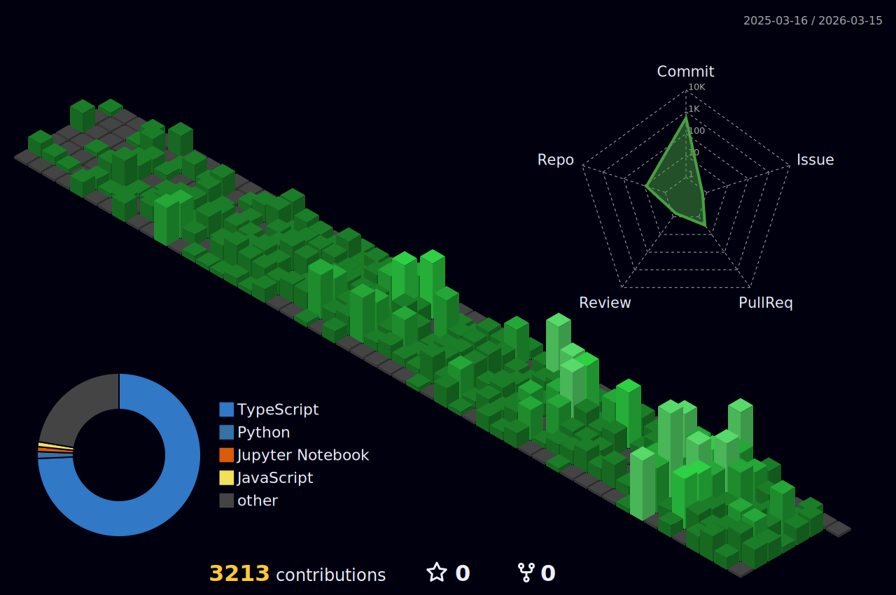

  <h1>Pedro Reoli | Desenvolvedor Fullstack Jr</h1>
  
  

    
    
    
  

  

    
    
    
    
  

  
  

---

## Ultimas Atualizacoes

<!-- INICIO_STATUS_LIVE -->

  <table>
    <tr>
      <td align="center"><strong>Status</strong></td>
      <td align="center"><strong>Projeto Ativo</strong></td>
      <td align="center"><strong>Ultima Atividade</strong></td>
      <td align="center"><strong>Commits Hoje</strong></td>
    </tr>
    <tr>
      <td align="center">Online</td>
      <td align="center">PedroReoli</td>
      <td align="center">Agora</td>
      <td align="center">10</td>
    </tr>
  </table>
  <i>Última atualização: 01/06/2025, 01:44:14</i>

<!-- FIM_STATUS_LIVE -->

---

## Sobre Mim

<!-- INICIO_SOBRE_MIM -->

Sou desenvolvedor full stack com foco em frontend e interesse constante por novas tecnologias. Atualmente sou estagiário na AutoCom3, onde atuo no desenvolvimento de sistemas com back-end e front-end integrados.
Tambem sou músico nas horas vagas,apaixonado por blues , rock e heavy metal

- Atualmente na **AutoCom3**, Estagiário de Desenvolvimento
- Desenvolvendo o [FalaAtípica](https://github.com/PedroReoli/falatipica-tutor) - TCC sobre acessibilidade e comunicação
- Sempre aprendendo algo novo em **React, Next.js, Node.js, Three.js, C#**
- Meu portfólio: [pedroreoliportfolio.vercel.app](https://pedroreoliportfolio.vercel.app)
- Blog onde escrevo sobre código: [devemdesenvolvimento.com.br/](https://www.devemdesenvolvimento.com.br/)
- **Plot twist:** Quando não estou debugando, estou tocando guitarra - viciado em guitarra, blues, rock
<!-- FIM_SOBRE_MIM -->

---

## Tech Stack

<!-- INICIO_TECH_STACK -->

  <h3>🛠️ Tech Stack</h3>
  
  <table>
  <tr><td align="center" width="96"></td><td align="center" width="96"></td><td align="center" width="96"></td><td align="center" width="96"></td><td align="center" width="96"></td><td align="center" width="96"></td></tr>
  <tr><td align="center" width="96"><b>React</b></td><td align="center" width="96"><b>Next.js</b></td><td align="center" width="96"><b>Angular</b></td><td align="center" width="96"><b>TypeScript</b></td><td align="center" width="96"><b>Tailwind CSS</b></td><td align="center" width="96"><b>Vite</b></td></tr>
  <tr><td align="center" width="96"></td><td align="center" width="96"></td><td align="center" width="96"></td><td align="center" width="96"></td><td align="center" width="96"></td><td align="center" width="96"></td></tr>
  <tr><td align="center" width="96"><b>Node.js</b></td><td align="center" width="96"><b>Python</b></td><td align="center" width="96"><b>C#</b></td><td align="center" width="96"><b>PostgreSQL</b></td><td align="center" width="96"><b>MongoDB</b></td><td align="center" width="96"><b>Prisma</b></td></tr>
  <tr><td align="center" width="96"></td><td align="center" width="96"></td><td align="center" width="96"></td><td align="center" width="96"></td><td align="center" width="96"></td><td align="center" width="96"></td></tr>
  <tr><td align="center" width="96"><b>Git</b></td><td align="center" width="96"><b>Docker</b></td><td align="center" width="96"><b>VS Code</b></td><td align="center" width="96"><b>Vercel</b></td><td align="center" width="96"><b>JavaScript</b></td><td align="center" width="96"><b>HTML5</b></td></tr>
  <tr><td align="center" width="96"></td><td align="center" width="96"></td><td align="center" width="96"></td><td align="center" width="96"></td><td align="center" width="96"></td><td></td></tr>
  <tr><td align="center" width="96"><b>CSS3</b></td><td align="center" width="96"><b>Figma</b></td><td align="center" width="96"><b>Firebase</b></td><td align="center" width="96"><b>MySQL</b></td><td align="center" width="96"><b>Linux</b></td><td></td></tr>
  </table>
  
  <i>23 tecnologias • Sempre evoluindo</i>

<!-- FIM_TECH_STACK -->

---

## GitHub Overview

<!-- INICIO_GITHUB_STATS -->

  <picture>
    <source media="(prefers-color-scheme: dark)" srcset="./assets/github-stats-dark.svg">
    <source media="(prefers-color-scheme: light)" srcset="./assets/github-stats-light.svg">
    
  </picture>
  
    
  
  
  
  
   
  
  

<!-- FIM_GITHUB_STATS -->

---

## Contribuicoes

<!-- INICIO_CONTRIBUICOES -->

  <h3>Pacman Contribution Graph</h3>
  <picture>
    <source media="(prefers-color-scheme: dark)" srcset="https://raw.githubusercontent.com/PedroReoli/PedroReoli/output/pacman-contribution-graph-dark.svg">
    <source media="(prefers-color-scheme: light)" srcset="https://raw.githubusercontent.com/PedroReoli/PedroReoli/output/pacman-contribution-graph.svg">
    
  </picture>
  
    
  
  <h3>Matriz de Contribuicoes 3D</h3>
  

<!-- FIM_CONTRIBUICOES -->
