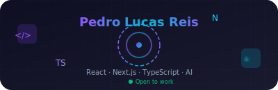

# <u>Pedro Lucas Reis</u>

### Mid Frontend Engineer | React, Next.js & TypeScript

 

---

## 💼 Professional Experience

### Software Engineer · Domus - Sua Solução Digital
`Oct 2025 - Present` · Freelance

- Websites, admin platforms and custom web applications
- Reusable and scalable frontend architectures
- API integrations and external services
- AI-assisted development workflows
- Lighthouse scores close to 100

### Frontend Engineer · SIVIS Tecnologia
`Nov 2025 - Present` · Freelance

- Corporate systems and business management platforms
- Frontend integrations with REST APIs
- Usability and performance improvements

### Full Stack Developer / Frontend Engineer · Autocom3
`Nov 2024 - Present` · Hybrid · Volta Redonda, RJ

- ERP systems, dashboards and admin platforms
- APIs and integrations for business workflows
- ERP modules with complex business rules

### FullStack Developer Jr · SIVIS Tecnologia
`Aug 2022 - Jun 2024` · Hybrid

- ERP systems for clubs, associations and vehicle protection

### Technology Mentor · UniFOA University
`Jun 2024 - Dec 2024`

- **EvaTech** program — digital inclusion and AI
- **30+ participants** mentored

---

## 🏆 Results & Achievements

| Metric | Result |
|--------|--------|
| Reusable Components | **300+** |
| Organizations Served | **20+** |
| FalaAtípica Score | **9.5/10** |
| Performance Boost | **40% faster** |
| Lighthouse Scores | **~100** |

---

## 🛠️ Tech Stack

---

## 🤖 AI in Workflow

Research · Documentation · Prototyping · Debugging · Code Review · Productivity

---

## 📊 Activity

  

---

  <i>Open to work · Frontend Engineer</i>

