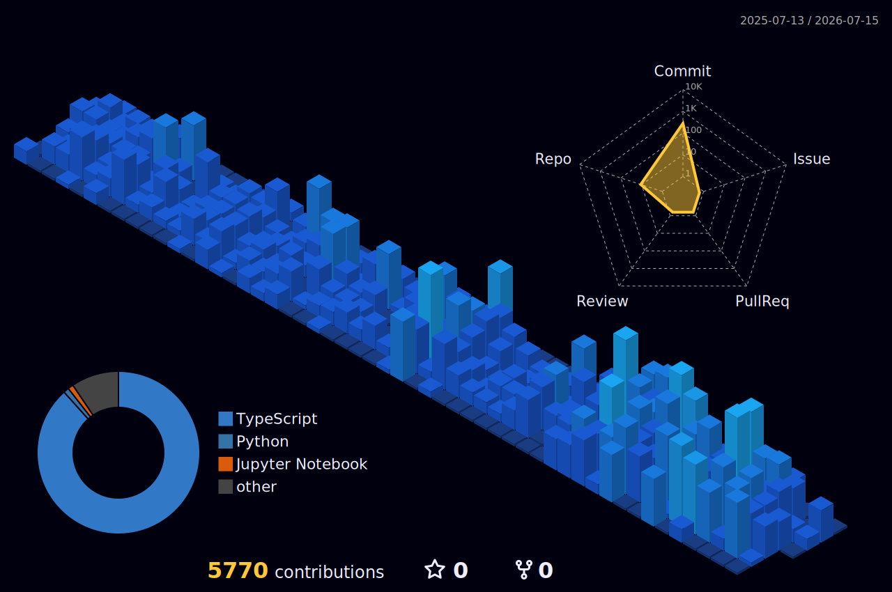

<h1 align="center">Pedro Lucas Reis</h1>
<h3 align="center">Full Stack Engineer · React · Next.js · Node.js · AI Integration</h3>

  
  
  
  
  
  

 

  

---

## About

Full Stack Engineer with 4+ years of experience building scalable web applications, backend services, and AI-powered products. I've worked across the full lifecycle — from migrating legacy systems to modern API-driven architectures, to designing large-scale ERP systems with complex business rules, to shipping SaaS products from scratch.

I care about clean architecture, real performance, and writing code that scales — both technically and as a product.

---

## What I'm building

Scalable frontend architectures with React and Next.js, full stack system design with clean API layers, and integrating LLMs into real products — not as a gimmick, but where they genuinely improve UX and developer velocity.

Currently shipping **[Propose](https://pedroreis.vercel.app/)** — a SaaS for proposal generation with digital signature and link tracking.

---

## Highlights

- Developed and maintained a full ERP ecosystem at **Autocom3**, handling complex business rules and multi-system integrations
- Migrated legacy codebases (Visual FoxPro → modern APIs) in production without downtime
- Built AI integrations including chat interfaces, copilots, and LLM-powered automation flows
- Designed and shipped **Propose** end-to-end — proposal builder, digital signature, and engagement tracking

---

## Tech Stack

  

  <b>Frontend</b> &nbsp;·&nbsp; React · Next.js · Angular · TypeScript · Tailwind CSS
   
  <b>Backend</b> &nbsp;·&nbsp; Node.js · C# · REST APIs · GraphQL
   
  <b>Data</b> &nbsp;·&nbsp; PostgreSQL · MySQL
   
  <b>AI</b> &nbsp;·&nbsp; LLM workflows · AI-driven interfaces · Automation pipelines
   
  <b>Tooling</b> &nbsp;·&nbsp; Git · Docker · Postman · Swagger

---

## GitHub Stats

  
  

---

## Contribution Graph

  <picture>
    <source media="(prefers-color-scheme: dark)" srcset="https://raw.githubusercontent.com/PedroReoli/PedroReoli/output/pacman-contribution-graph-dark.svg">
    <source media="(prefers-color-scheme: light)" srcset="https://raw.githubusercontent.com/PedroReoli/PedroReoli/output/pacman-contribution-graph.svg">
    
  </picture>

  <i>Made with focus, coffee, and way too many tabs open.</i>

