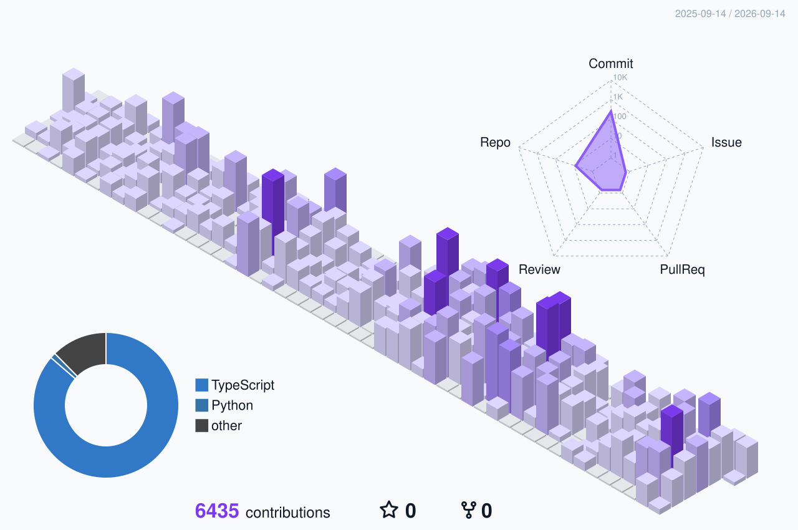

# Pedro Lucas Reis

### Full Stack Software Engineer

**TypeScript • React • Next.js • Node.js • NestJS • PostgreSQL**

 

---

## 👨‍💻 About

Full Stack Engineer with around **4 years of experience** building ERP systems, SaaS products, enterprise platforms and modern web applications.

Strong background in Frontend Engineering, with hands-on experience across **backend, APIs, PostgreSQL, AWS, software architecture and AI Engineering**.

---

## 🏆 Highlights

- 🚀 **10+ digital products**
- 🏢 Platforms used by **20+ organizations**
- 🧩 Design System with **500+ reusable components**
- ⚡ Up to **70% faster development** in selected workflows
- 📈 Up to **40% improvement in application load time**
- 💡 ERP ecosystem with **50+ pages**

---

## 🛠️ Tech Stack

 

---

## 🚀 Featured Work

**ERP Ecosystem**  
Enterprise portals, dashboards and administrative platforms with **50+ pages**, APIs, integrations and multi-tenant environments.

**Design System**  
Shared architecture with **500+ reusable components** focused on scalability and development speed.

**Electron → Tauri**  
Desktop ERP modernization focused on performance and application efficiency.

**ReoliOS**  
AI Engineering ecosystem built around **Spec-Driven Development, AI Skills, Agent Loops and reusable engineering workflows**.

---

## 🤖 AI Engineering

AI applied throughout the software engineering workflow:

**Research • Specifications • Documentation • Prototyping • Debugging • Code Review • Automation**

Exploring and building with:

**Spec-Driven Development • AI Skills • Agent Loops • Context Engineering**

---

## 📊 Activity

---

### Open to Full Stack Software Engineering opportunities

[LinkedIn](https://www.linkedin.com/in/pedro-lucas-reis-a93945171/) • [Portfolio](https://pedroreis.vercel.app/)

