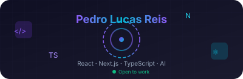

# <u>Pedro Lucas Reis</u>

### Full Stack Software Engineer | TypeScript • React • Node.js • PostgreSQL | APIs • Cloud • AI Engineering

 

---

## 👨‍💻 About Me

Full Stack Engineer with around **4 years of experience** building digital products, ERP systems, SaaS platforms and enterprise applications.

My core stack is **TypeScript, React, Next.js, Node.js, NestJS and PostgreSQL**, with a strong Frontend background and hands-on experience across Backend, APIs, databases, AWS/Cloud, security and software architecture.

Throughout my career, I have contributed to **10+ digital products**, platforms used by **20+ organizations**, an ERP ecosystem with **50+ pages**, and a Design System with **500+ reusable components**.

I also use AI as an engineering tool for research, specification, documentation, prototyping, code review, automation and development workflows.

---

## 💼 Professional Experience

### Full Stack Engineer · Domus - Sua Solução Digital
`Oct 2025 - Present` · Freelance

- End-to-end development of SaaS, B2B and custom web applications
- Frontend, backend, databases, integrations and architecture decisions
- REST APIs and third-party integrations
- PostgreSQL and Supabase
- React, Next.js, TypeScript, Node.js, Express and Fastify
- Lighthouse scores close to **100**

### Full Stack Engineer | Frontend & Integrations · SIVIS Tecnologia
`Nov 2025 - Present` · Freelance · Remote

- Web applications built with React, Next.js and Angular
- Frontend architecture improvements and application modernization
- Integrations with REST APIs and external services
- Performance, usability, componentization and maintainability improvements
- Enterprise systems and business management platforms

### Full Stack Engineer · Autocom3
`Nov 2024 - Present` · Hybrid · Volta Redonda, RJ

- Full Stack development for ERP platforms, portals, dashboards and enterprise applications
- APIs with Node.js, NestJS and C#
- Authentication, JWT, permissions, rate limiting and Webhooks
- PostgreSQL queries, migrations, indexes and procedures
- AWS, API Gateway, deployments and event-driven integrations
- White-label and multi-tenant architectures
- Electron applications and migration to Tauri
- Design System leadership and architecture modernization

### Technology Mentor · UniFOA University
`Jun 2024 - Dec 2024`

- **EvaTech** program focused on technology, digital inclusion and AI
- Mentoring and hands-on learning activities
- Educational content about AI and digital tools
- **30+ participants mentored**

### Junior Full Stack Engineer · SIVIS Tecnologia
`Aug 2022 - Jun 2024` · Full-time · Hybrid

- ERP systems, dashboards and administrative platforms
- Frontend and backend development
- REST APIs and external service integrations
- Complex business rules and operational workflows
- PostgreSQL and MySQL
- Production systems used by clubs, associations and vehicle protection organizations

---

## 🏆 Results & Achievements

| Metric | Result |
|---|---:|
| Digital Products | **10+** |
| Organizations Using Platforms | **20+** |
| ERP Ecosystem | **50+ pages** |
| Reusable Components | **500+** |
| Development Time Reduction | **Up to 70%** |
| Load Time Improvement | **Up to 40%** |
| Lighthouse Scores | **~100** |
| Participants Mentored | **30+** |

---

## 🛠️ Core Tech Stack

---

## ⚙️ Engineering

---

## 🧠 Areas of Expertise

- Full Stack Development
- Frontend Architecture
- REST APIs & Integrations
- Authentication & Authorization
- PostgreSQL
- Design Systems
- SaaS & B2B Applications
- ERP Systems
- White-label & Multi-tenant Platforms
- Event-driven Integrations
- AWS / Cloud
- Legacy Modernization
- Electron & Tauri
- AI Engineering

---

## 🤖 AI Engineering

I use Artificial Intelligence throughout the engineering workflow for:

**Research · Specifications · Documentation · Prototyping · Debugging · Code Review · Automation · Productivity**

I also explore:

**Spec-Driven Development · AI Skills · Agent Loops · Context Engineering**

---

## 📊 Activity

  

---

### Open to opportunities as a Full Stack Software Engineer

**TypeScript · React · Next.js · Node.js · NestJS · PostgreSQL**

