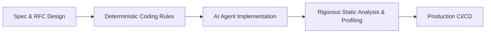
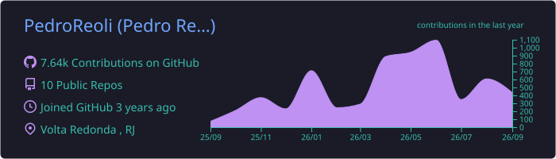
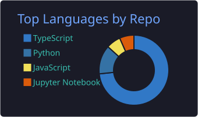
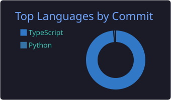
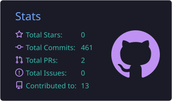

# Pedro Lucas Reis
### Senior Full Stack Software Engineer & Frontend Architect

**TypeScript · React · Next.js · Node.js · NestJS · PostgreSQL · Cloud AWS · AI Engineering**

  
  
  
  

📍 *Volta Redonda, RJ · Brazil (Available for Global Remote / B2B Contracts)*

---

### ⚡ Proven Engineering Impact

| 🚀 **4+ Years Experience** | 🏢 **20+ Client Organizations** | 📦 **10+ Digital Products** |
| :---: | :---: | :---: |
| **🎨 500+ DS Components** | **⚡ -40% Load Time (ERP)** | **💯 ~100 Lighthouse Metrics** |

---

## 🛠️ Core Tech Stack

| Layer | Technologies & Ecosystem |
| :--- | :--- |
| **Frontend Architecture** | `TypeScript` · `React 18/19` · `Next.js (App Router)` · `Tailwind CSS` · `Radix UI` · `TanStack Query/Virtual` · `Storybook` |
| **Backend & Microservices** | `Node.js` · `NestJS` · `Express` · `C# .NET Core` · `REST & GraphQL` · `WebSockets` · `RabbitMQ / Kafka` |
| **Data & Cloud Infrastructure** | `PostgreSQL (pgvector)` · `Prisma / Drizzle` · `Redis` · `Docker` · `AWS (S3, Lambda, ECS, CloudFront)` |
| **AI & Automation Engineering** | `Autonomous Agents (CDP)` · `LangChain` · `RAG / Embeddings` · `Claude / OpenAI / Gemini APIs` · `Playwright` |

 

---

## 🧠 AI Engineering & Architecture Workflow

I apply **Spec-Driven Engineering** and deterministic agent workflows to accelerate delivery while keeping architecture and code quality under strict control:

```mermaid
graph LR
    A[Spec & RFC Design] --> B[Deterministic Coding Rules]
    B --> C[AI Agent Implementation]
    C --> D[Rigorous Static Analysis & Profiling]
    D --> E[Production CI/CD]
```

- **Deterministic Governance**: Monitored context engineering with local skills, strict typing, and zero runtime drift.
- **Deep Profiling**: Performance optimization with Chrome DevTools Profiler, memory leak audits, and render tree pruning.

---

### 📈 Activity & Contribution Matrix

<picture>
  <source media="(prefers-color-scheme: dark)" srcset="https://raw.githubusercontent.com/PedroReoli/PedroReoli/output/github-contribution-grid-snake-dark.svg">
  <source media="(prefers-color-scheme: light)" srcset="https://raw.githubusercontent.com/PedroReoli/PedroReoli/output/github-contribution-grid-snake.svg">
  
</picture>

  

  
  

  
  

 

### 🤝 Let's build something exceptional together

[LinkedIn](https://www.linkedin.com/in/pedro-lucas-reis-a93945171/) · [Portfolio](https://pedroreis.vercel.app/) · [E-mail](mailto:pedrosousa2160@gmail.com) · [WhatsApp](https://wa.me/5524993264040)

