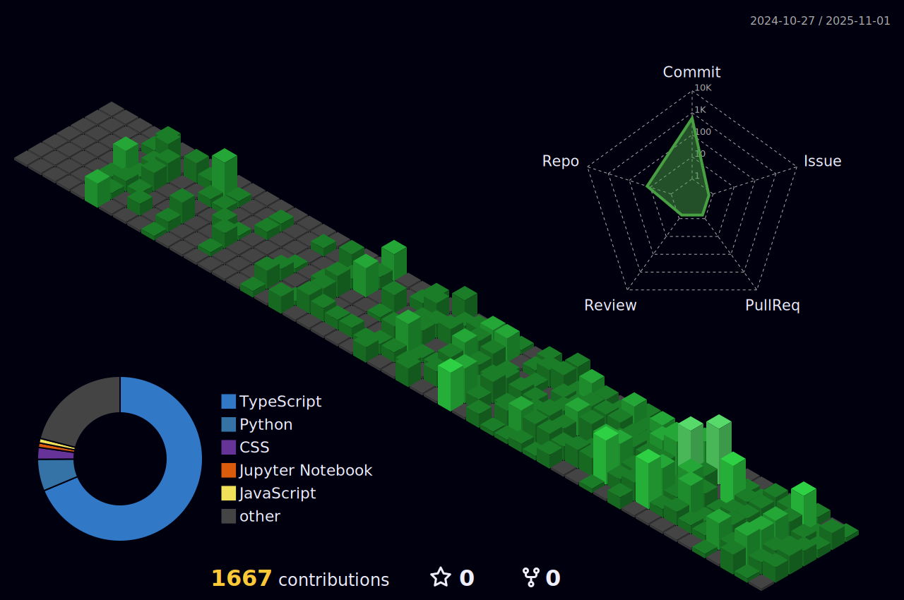

  <h1>Pedro Reoli | Desenvolvedor Fullstack Jr</h1>
  
  

    
    
    
  

  

    
    
    
    
  

  
  

## Ultimas Atualizacoes

  <table>
    <tr>
      <td align="center"><strong>Status</strong></td>
      <td align="center"><strong>Projeto Ativo</strong></td>
      <td align="center"><strong>Ultima Atividade</strong></td>
      <td align="center"><strong>Commits Hoje</strong></td>
    </tr>
    <tr>
      <td align="center">Online</td>
      <td align="center">PedroReoli</td>
      <td align="center">Agora</td>
      <td align="center">10</td>
    </tr>
  </table>
  <i>Atualizado via GitHub Actions</i>

## Sobre Mim

Opa! Sou desenvolvedor Full Stack com foco em Frontend, sempre buscando transformar ideias malucas em experiências digitais que realmente funcionam. Trabalho na Autocom3 criando sistemas ERP que não fazem as pessoas chorarem de desespero.

- Atualmente na **Autocom3**, Desenvolvedor Full Stack
- Desenvolvendo o [FalaAtipica](https://github.com/PedroReoli/falatipica-tutor) - TCC sobre acessibilidade comunicativa
- Sempre aprendendo algo novo em **React, Next.js, Three.js, Node.js, C#**
- Meu portfólio: [pedroreoliportfolio.vercel.app](https://pedroreoliportfolio.vercel.app)
- Blog onde escrevo sobre código: [devemdesenvolvimento.com.br/](https://www.devemdesenvolvimento.com.br/)
- **Plot twist:** Quando não estou debugando, estou tocando guitarra - viciado em Tocar guitarra, Blues, Metal, Rock

## Tech Stack

### Frontend & UI

|  |  |  |  |
| :---: | :---: | :---: | :---: |
|  |  |  |  |
| **React** | **Next.js** | **Angular** | **TypeScript** |

### Backend & Languages

|  |  |  |
| :---: | :---: | :---: |
|  |  |  |
| **Node.js** | **Python** | **C#** |

### Database & Storage

|  |  |
| :---: | :---: |
|  |  |
| **PostgreSQL** | **MongoDB** |

### Tools & DevOps

|  |  |  |
| :---: | :---: | :---: |
|  |  |  |
| **Git** | **VS Code** | **Vercel** |

  <i>Stack sempre em evolução • Atualizado via GitHub Actions</i>

### Backend & Languages

|  |  |  |
| :---: | :---: | :---: |
|  |  |  |
| **Node.js** | **Python** | **C#** |

### Database & Storage

|  |  |
| :---: | :---: |
|  |  |
| **PostgreSQL** | **MongoDB** |

### Tools & DevOps

|  |  |  |
| :---: | :---: | :---: |
|  |  |  |
| **Git** | **VS Code** | **Vercel** |

  <i>Stack sempre em evolução • Atualizado via GitHub Actions</i>

### Frontend & UI

|  |  |  |  |
| :---: | :---: | :---: | :---: |
|  |  |  |  |
| **React** | **Next.js** | **Angular** | **TypeScript** |

### Backend & Languages

|  |  |  |
| :---: | :---: | :---: |
|  |  |  |
| **Node.js** | **Python** | **C#** |

### Database & Storage

|  |  |
| :---: | :---: |
|  |  |
| **PostgreSQL** | **MongoDB** |

### Tools & DevOps

|  |  |  |
| :---: | :---: | :---: |
|  |  |  |
| **Git** | **VS Code** | **Vercel** |

  <i>Stack sempre em evolução • Atualizado via GitHub Actions</i>

### Frontend & UI

|  |  |  |  |
| :---: | :---: | :---: | :---: |
| **React** | **Next.js** | **Angular** | **TypeScript** |

### Backend & Languages

|  |  |  |
| :---: | :---: | :---: |
| **Node.js** | **Python** | **C#** |

### Database & Storage

|  |  |
| :---: | :---: |
| **PostgreSQL** | **MongoDB** |

### Tools & DevOps

|  |  |  |
| :---: | :---: | :---: |
| **Git** | **VS Code** | **Vercel** |

  <i>Stack sempre em evolução • Atualizado via GitHub Actions</i>

## GitHub Overview

  <picture>
    <source media="(prefers-color-scheme: dark)" srcset="./assets/github-stats-dark.svg">
    <source media="(prefers-color-scheme: light)" srcset="./assets/github-stats-light.svg">
    
  </picture>
  
    
  
  
  
  
   
  
  

## Contribuicoes

  <h3>Pacman Contribution Graph</h3>
  <picture>
    <source media="(prefers-color-scheme: dark)" srcset="https://raw.githubusercontent.com/PedroReoli/PedroReoli/output/pacman-contribution-graph-dark.svg">
    <source media="(prefers-color-scheme: light)" srcset="https://raw.githubusercontent.com/PedroReoli/PedroReoli/output/pacman-contribution-graph.svg">
    
  </picture>
  
  <h3>Matriz de Contribuicoes 3D</h3>
  

  

