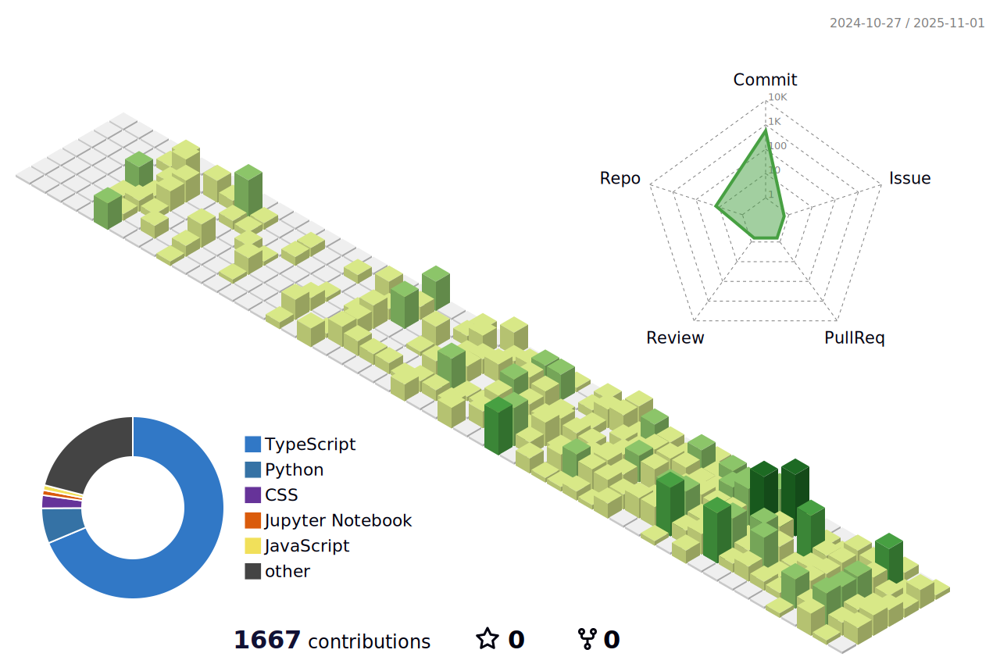

  

  

  
  
  

---

### Sobre Mim

  
• <strong>Desenvolvedor Full Stack</strong> apaixonado por criar experiências digitais intuitivas

  
• <strong>Estagiário na AutoCom3</strong> desenvolvendo sistemas integrados

  
• <strong>Foco em React, Next.js e C#</strong> para soluções robustas

  
• <strong>Músico e guitarrista</strong> explorando harmonias do blues e rock

  
• <strong>Especialista em acessibilidade</strong> e desenvolvimento de soluções inovadoras

---

  <table>
    <tr>
      <td align="left" width="60%">
        <h3>FalaAtípica</h3>
        
Sistema completo de auxílio para crianças com atraso de fala, desenvolvido como projeto de TCC.

        
<strong>Aplicações:</strong>

        <ul>
          <li><strong>KIDS</strong> - Jogos educativos para crianças</li>
          <li><strong>TUTORS</strong> - Acompanhamento para pais/responsáveis</li>
          <li><strong>PRO</strong> - Ferramentas profissionais para fonoaudiólogos</li>
        </ul>
        
<strong>Tecnologias:</strong> React Native e React com TypeScript

      </td>
      <td align="center" width="40%">
        
      </td>
    </tr>
  </table>

---

### Minha Stack

  <table>
    <tr>
      <td align="center" width="60%">
        
      </td>
      <td align="center" width="40%">
        
      </td>
    </tr>
  </table>

  

  <picture>
    <source media="(prefers-color-scheme: dark)" srcset="https://raw.githubusercontent.com/PedroReoli/PedroReoli/output/pacman-contribution-graph-dark.svg">
    <source media="(prefers-color-scheme: light)" srcset="https://raw.githubusercontent.com/PedroReoli/PedroReoli/output/pacman-contribution-graph.svg">
    
  </picture>

---

