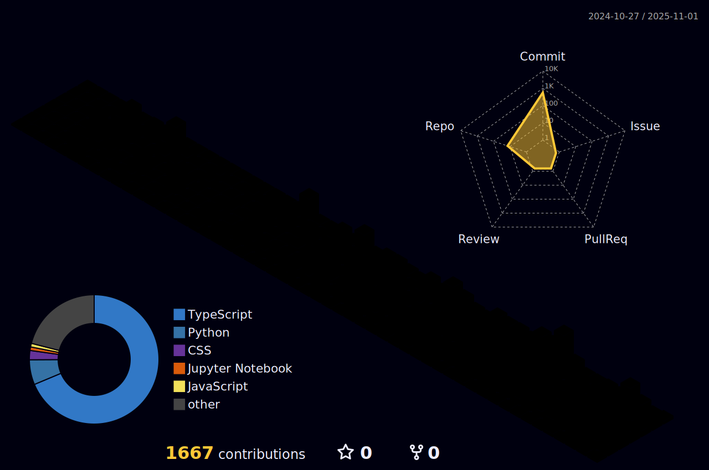

  <h1>Pedro Reoli | Desenvolvedor Fullstack Jr</h1>
  
  

    
    
    
  

  

    
    
    
    
  

  
  

## 👨‍💻 Sobre Mim

**Desenvolvedor Full Stack** especializado em **Frontend**, transformando ideias em experiências digitais extraordinárias. Na **Autocom3**, aplico minha expertise em desenvolvimento Full Stack para criar soluções digitais que fortalecem a presença online da marca.

- 💼 Atualmente na **Autocom3**, desenvolvendo sistemas ERP para automação comercial
- 🎓 Em desenvolvimento: [FalaAtipica](https://github.com/PedroReoli/falatipica-tutor) - TCC focado em acessibilidade comunicativa
- 🚀 Aprimorando habilidades em **React, Next.js, Three.js, Node.js e C#**
- 👨‍💻 Portfólio: [pedroreoliportfolio.vercel.app](https://pedroreoliportfolio.vercel.app)
- 📝 Blog: [Dev em Desenvolvimento](https://www.devemdesenvolvimento.com.br/)
- 🎸 **Curiosidade:** Quando não estou codando, estou criando música - apaixonado por Blues, Metal e Rock 🤘

## 🌠 Minha Stack

  <!-- Frontend -->
  <h4>Frontend</h4>
  

    &nbsp;
    &nbsp;
    &nbsp;
    &nbsp;
    &nbsp;
    &nbsp;
    &nbsp;
    
  

  
  <!-- Backend -->
  <h4>Backend</h4>
  

    &nbsp;
    &nbsp;
    &nbsp;
    &nbsp;
    &nbsp;
    &nbsp;
    &nbsp;
    
  

  
  <!-- Databases -->
  <h4>Databases</h4>
  

    &nbsp;
    &nbsp;
    &nbsp;
    
  

  
  <!-- DevOps & Tools -->
  <h4>DevOps & Tools</h4>
  

    &nbsp;
    &nbsp;
    &nbsp;
    &nbsp;
    &nbsp;
    &nbsp;
    
  

## 📊 GitHub Stats

  

    
    
  

  
  

## 🎮 Contribuições

  <h3>Pacman Contribution Graph</h3>
  <picture>
    <source media="(prefers-color-scheme: dark)" srcset="https://raw.githubusercontent.com/PedroReoli/PedroReoli/output/pacman-contribution-graph-dark.svg">
    <source media="(prefers-color-scheme: light)" srcset="https://raw.githubusercontent.com/PedroReoli/PedroReoli/output/pacman-contribution-graph.svg">
    
  </picture>
  
  <h3>Matriz de Contribuições 3D</h3>
  

